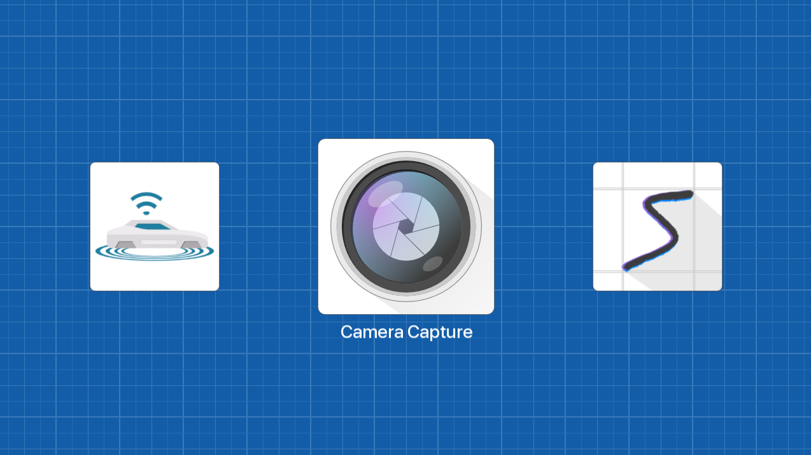

# Dashboard
SFML.NET Application Dashboard

## Details
- C# Application
- .NET Core
- SFML (2D Graphics)
- Dashboard for projects

## Why?
I have been programming for a long time. When I initially startred, I was at university, and I was not familiar with Git. I use to work on small little projects that I was excited about, get them to a state where they were decent (okay, not <strong>all</strong> of them), then zip the project folder, and chuck it on a hard drive and forget about it. Which was fine, until one day someone asked me what I do in my spare time, and the honest answer was nothing worth showing... 

So I wanted to create a place to hold all of the things I work on, in case Iw ant to show someone, or pick it back up and go back to it after 6 months.

## What?
This solution has two things at its core. 

### 'Shared' class library
A shared project, where all of the things that could ever be reused go. It has simple things such as cameras, and screens; but also has a Genetic Algorithm and Neural Network that are both used in applications in the solution. 

### 'Dashboard'
The dashboard is the bread and butter of this whole endevor. It is a landing page for all my applications. It will sniff a directory, grab out the dll's and instantiate instances of the applications I've written, and mark them up, presenting them nicely.

The dashboard handles things like starting/stopping applications, error handling and more. it is a powerful concept and could be expanded to do a lot more, but this is what it does for now. It allows me easy access to the projects I've worked on in the past, or am working on now.

## Solution Structure
- All projects depend on shared
- ApplicationInstances depend on Application
- All ApplicationInstances implement IApplicationInstance in Shared, which is what the Dashboard uses to find and instantiate them.

### Known Issues
- If you are having random build failures, either turn of parallel build, or add a sudo-hierachy between the application instances. I think it's to do with multiple applications attempting to copy the same dlls into the target directory.

## Applications

### Maze Solver

### Driving Simulation / Self-Driving Neural Network

### Number Prediction Neural Network

